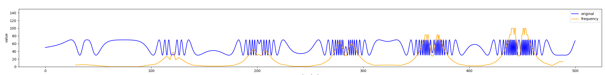

# Funscript Converter

A Python script to convert and process funscript files that are primarily intended for strokers for other devices. it converts positional values into frequency, magnitude or trend data.

Here are some examples of what it does. The following image shows the output if the frequency option is used. The original (blue) signal is converted into a frequency (orange) signal.


The following image shows what the trend and magnitude options do. 


## Usage

The script takes the following command-line arguments:

* `-i` or `--input`: Input filename. This is the funscript that needs to be processed.
* `-o` or `--output`: Output filename. This is the filename of the converted funscript
* `-a` or `--append-name`: Additionally, you can specify something like `"L0"` so that the output filename becomes `original filename.L0.funscript`
* `-t` or `--trend`: Use bias/trend/offset option this selects the midpoint of oscillations as the values. Note that this does not get normalized between 0-100
* `-f` or `--frequency`: Use frequency option. This tries to find the frequency of oscilations, determines the frequency over time and normalizes it between 0-100. 
* `-m` or `--magnitude`: Use magnitude option. This tries to find the magnitude of oscilations and then normalizes it between 0-100.
* `-p` or `--plot`: Displays an image containing the original and the converted funscript. This is optional


the following arguments are required:
1. input
2. one of (output or append-name)
3. one of (trend, frequency or magnitude)


## Requirements


The script requires the following Python libraries:

* `numpy`
* `matplotlib`
* `scipy`

## Installation


To install the required libraries, run the following command:
`pip install -r requirements.txt`

## Example usage
```bash
python funscript_converter.py -i "/path/to/my.funscript" -o "path/to/my/new.funscript" -t
```
This converts the `"/path/to/my.funscript"` script into `"path/to/my/new.funscript"` using the trend option

```bash
python funscript_converter.py -i "/path/to/my.funscript" -a "L1" -m
```
This converts the `"/path/to/my.funscript"` script into `"path/to/my/my.L0.funscript"` using the magnitude option

```bash
python funscript_converter.py -i "/path/to/my.funscript" -a "L1" -mp
```
This converts the `"/path/to/my.funscript"` script into `"path/to/my/my.L0.funscript"` using the magnitude option and shows you a plot of the original and converted signal

